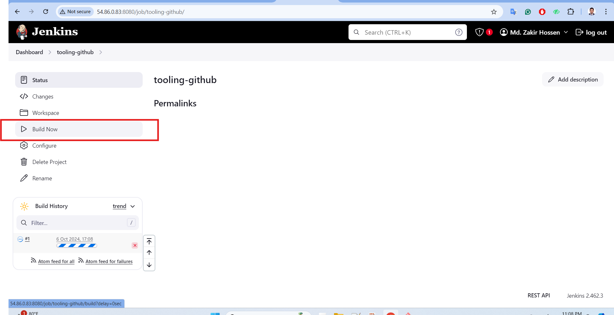
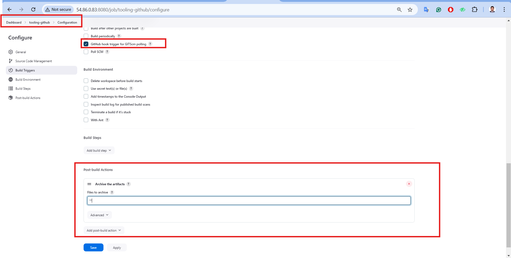

# Tooling Website deployment automation with Continuous Integration using Jenkins

In this project we are going to start automating part of our routine tasks with a free and open source automation server - Jenkins. It is one of the mostl popular CI/CD tools.

Acording to Circle CI, Continuous integration (CI) is a software development strategy that increases the speed of development while ensuring the quality of the code that teams deploy. Developers continually commit code in small increments which is then automatically built and tested before it is merged with the shared repository.

## Task

Enhance the architecture prepared in the previous project by adding a ```Jenkins``` server, configure a job to automatically deploy source codes changes from ```Git``` to ```NFS``` server.

Here is how the updated architecture looks.


# Step 1 - Install Jenkins server

## 1. Create an aws EC2 instance based on Ubuntu Server 24.04 LTS and name it ```Jenkins```


## 2. Install JDK since Jenkins is a Java-based application

__Access the instance__

```bash
ssh -i "my-server-key.pem" ubuntu@54.86.0.83
```


__Update the Instance__

```bash
sudo apt-get update && sudo apt-get upgrade -y
```


__Download the Jenkins key__

```bash
sudo wget -O /usr/share/keyrings/jenkins-keyring.asc \
    https://pkg.jenkins.io/debian-stable/jenkins.io-2023.key
```


__Add the Jenkins Repository__

```bash
echo "deb [signed-by=/usr/share/keyrings/jenkins-keyring.asc]" \
    https://pkg.jenkins.io/debian-stable binary/ | sudo tee \
    /etc/apt/sources.list.d/jenkins.list > /dev/null
```


__Install Java__

Jenkins requires Java to run, yet not all Linux distributions include Java by default. Additionally, not all Java versions are compatible with Jenkins. Install ```OpenJDK 17```

```bash
sudo apt-get install fontconfig openjdk-17-jre
```


## 3. Install Jenkins

__Update ubuntu__

```bash
sudo apt-get update
```


__Install Jenkins__

```bash
sudo apt-get install jenkins -y
```


__Ensure jenkins is up and running__

```bash
sudo systemctl enable jenkins
sudo systemctl start jenkins
sudo systemctl status jenkins
```


## 4. By default Jenkins server uses TCP port 8080 - open it by creating a new Inbound rule in the EC2 Security Group


## 5. Perform initial Jenkins setup

From a browser access ```http://<Jenkins-Server-Public-IP-Address>:8080```
You will be prompted to provide a default admin password.
Retrieve it from the server.

```bash
http://54.86.0.83:8080/
```

```bash
sudo cat /var/lib/jenkins/secrets/initialAdminPassword
```


Then you will be asked which plugins to install - choose suggested plugins


Once plugins installation is done, create an admin user and you will get the jenkins server address.


The installation is complete


# Step 2 - Configure Jenkins to retrieve source codes from GitHub using Webhooks

In this part, we will learn how to configure a simple Jenkins job/project. This job will will be triggered by GitHub webhooks and will execute a build task to retrieve codes from GitHub and store it locally on Jenkins server.

## 1. Enable webhooks in your GitHub repository settings.

On your GitHub repository,

Select Settings > Webhooks > Add webhook


## 2. Go to Jenkins web console, click ``New Item`` and create a ``Freestyle project``


__To connect our GitHub repository, we will need to provide its URL, we can copy from the repository itself__

```bash
https://github.com/zakircmt/tooling.git
```


In configuration of our Jenkins freestyle project choose Git repository, provide there the link to our Tooling GitHub repository and credentials (user/password) so Jenkins could access files in the repository.


Save the configuration and try to run the build. For now we can only do it manually. Click ``Build Now`` button. After all was configured correctly, the build was successfull and was seen under #1
You can open the build and check in Console Output if it has run successfully.




But this build does not produce anything and it runs only when we trigger it manually. Let us fix it.


## 3. Click Configure our job/project and add these two configurations

__Configure ``triggering the job from GitHub webhook`` and also Configure ``Post-build Actions`` to ``archive all the files`` - files resulted from a build are called artifacts:__




Now, go ahead and make some change in any file in our GitHub repository (e.g. README.MD file) and push the changes to the main branch.


we will see that a new build has been launched automatically by webhook and its results - artifacts, saved on Jenkins server.

### Note: I had to try several times for testing, that's why I am showing #7


Now we configured an automated Jenkins job  that receives files from GitHub by webhook trigger this method is considered as push because the changes are being pushed and files transfer is initiated by GitHub. There are also other methods: ``trigger one job (downstreadm) from another (upstream)``, ``poll GitHub periodically`` and others.

By default, the artifacts are stored on Jenkins server locally

```bash
ls /var/lib/jenkins/jobs/tooling-github/builds/<build_number>/archive/
```


# Step 3 - Configure Jenkins to copy files to NFS server via SSH

Now we have our artifacts saved locally on Jenkins server, the next step is to copy them to our NFS server to /mnt/apps directory.

Jenkins is a highly extendable application and there are more than 1400 plugins available. now we will need a plugin that is called ``Publish Over SSH``

### 1. Install Publish Over SSH plugin.

On main dashboard, Select Manage Jenkins > Manage Plugins > Available > Search for Publish over SSH and Install without restart.


### 2. Configure the job/project to copy artifacts over to NFS server

On main dashboard select ``Manage Jenkins > Configure System`` menu item.

Scroll down to Publish over SSH plugin configuration section and configure it to be able to connect to your NFS server:

- Provide a ``private key`` (content of .pem file that we use to connect to NFS server via SSH/Putty)

- Arbitrary name

- Hostname - can be ``private IP address`` of our ``NFS`` server

- Username - ``ec2-user`` (since NFS server is based on EC2 with RHEL 9)

- Remote directory - ``/mnt/apps`` since our Web Servers use it as a mointing point to retrieve files from the NFS server
- ``Save``


Test the configuration and make sure the connection returns Success. N.B that TCP port 22 on NFS server must be open to receive SSH connections


Save the configuration, open your Jenkins job/project configuration page and add another one Post-build Action (``Send build artifact over ssh``).

Also, Configure it to send all files produced by the build into our previouslys define remote directory In our case we want to copy all files and directories, so we use ``**``  If you want to apply some particular pattern to define which files to send - [use this syntax](https://ant.apache.org/manual/dirtasks.html#patterns)


Save this configuration and go ahead, change something in README.MD file in our GitHub Tooling repository


Webhook is not working with NFS


The error in the build #8 above indicates that we need to set permissions for user ec2-user on the NFS server : Ensure the target directory (/mnt) and it's contents on the NFS server has the correct permissions. We might need to change ownership or modify the permissions to allow the Jenkins user to write to it.

```bash
df -h
cd /mnt/apps
ls -a
ls -lrt /mnt/apps

sudo chown -R ec2-user:ec2-user /mnt/apps
ls -lrt /mnt/apps

sudo chmod -R 777 /mnt/apps
ls -lrt /mnt/apps
```


__Run the build again from jenkins GUI__

Webhook triggers a new job and in the Console Output of the job we get something like this:

```bash
SSH: Transferred 1 file(s)
Finished: SUCCESS
```


__To make sure that the files in ``/mnt/apps`` have been updated - connect via SSH to our NFS Server and verify README.MD file__

```bash
ls /mnt/apps
or
ls -l /mnt/apps

cat /mnt/apps/README.md
```


If you see the changes you had previously made in your GitHub - the job works as expected.

## Note:
__Issue: Some files were missing from the repository but have since been uploaded after the project completion.__

__Automation: The project is built automatically and stored in the NFS directory /mnt/apps.__

__Screenshot: A screenshot was provided to confirm the file upload after the project.__


